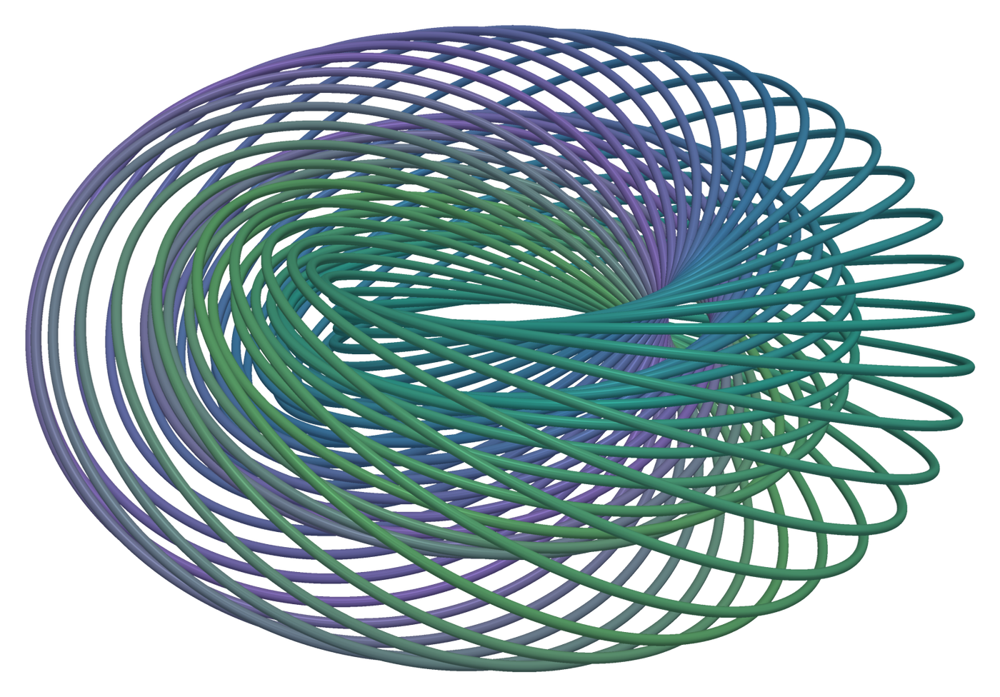

# HDMaps
[](https://github.com/MorphMath/HDMaps/actions/workflows/test.yml)
[](https://opensource.org/licenses/MIT)
[](https://morphmath.github.io/HDMaps/)

<p align="center">
  
  <br>
  <sub><em>Fibres of the <a href="https://en.wikipedia.org/wiki/Hopf_fibration">Hopf fibration</a>, which maps the 3-sphere onto the 2-sphere. Each circle is the fibre over one point of the 2-sphere, shown after stereographic projection to 3D.</em></sub>
</p>

**A Python implementation of Horizontal Diffusion Maps (HDM), a manifold learning framework for data analysis of datasets with base-fiber structure.**

## What is HDMaps?

HDM extends diffusion maps to collections of related data objects, such as a shape or image collection. A random walk on the collection (the base) is lifted through correspondence maps across each object's internal structure (the fiber). This produces a shared coordinate system that jointly embeds each object's internal structure and the pairwise relations between objects.

<p align="center">
  
  <br>
  <sub><em>A random walk on a neighbor graph on the base manifold lifted through the fibres: hopping between objects moves to the corresponding point on each object's structure.</em></sub>
</p>


## Installation
To install the latest development version of HDMaps run:
```bash
pip install git+https://github.com/MorphMath/HDMaps
```

## Documentation and Usage
Documentation is at [morphmath.github.io/HDMaps](https://morphmath.github.io/HDMaps/). See [examples/](examples/) for usage examples.

## Citing
If you use HDMaps in your work, please cite the [paper](https://www.sciencedirect.com/science/article/pii/S1063520318302215) that introduced Horizontal Diffusion Maps:

```bibtex
@article{gao2021diffusion,
title = {The diffusion geometry of fibre bundles: Horizontal diffusion maps},
journal = {Applied and Computational Harmonic Analysis},
volume = {50},
pages = {147-215},
year = {2021},
issn = {1063-5203},
doi = {10.1016/j.acha.2019.08.001},
url = {https://www.sciencedirect.com/science/article/pii/S1063520318302215},
author = {Tingran Gao},
keywords = {Diffusion geometry, Manifold learning, Laplacian, Fibre bundles},
}
```

## License

This software is licensed under the MIT License. See the [LICENSE](LICENSE) file for details.
